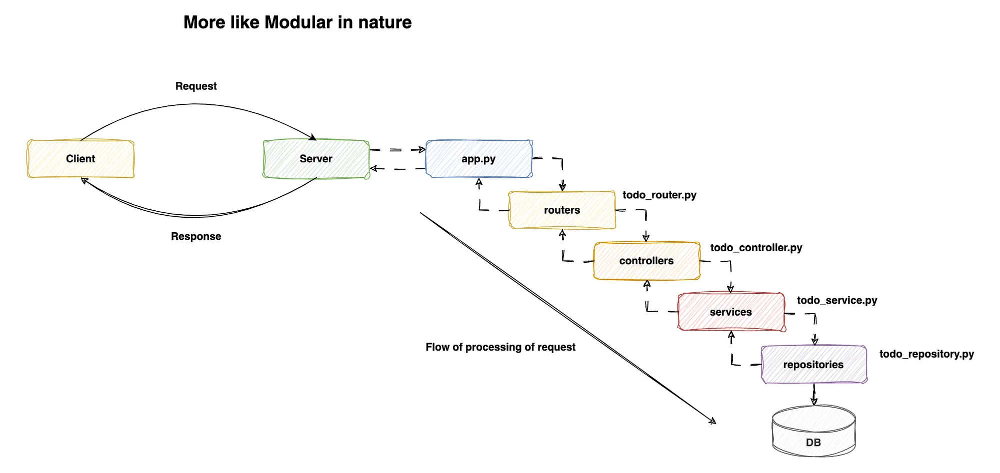

## FastAPI and Uvicorn application
### 1. Modular Architecture

### 2. Key Benefits of Modular Architecture:
- **Improved Maintainability:** Each component — routers, controllers, services, and repositories — now handles specific responsibilities, reducing the risk of unintended side effects when making changes.
- **Enhanced Testability:** With distinct layers, unit testing becomes more straightforward. We can test each component in isolation, ensuring robustness and reliability across our application.
- **Scalability and Flexibility:** Modular design facilitates easier scalability. New features can be added or existing ones modified without extensive reworking of the entire codebase. This flexibility extends to switching databases or updating business logic seamlessly.